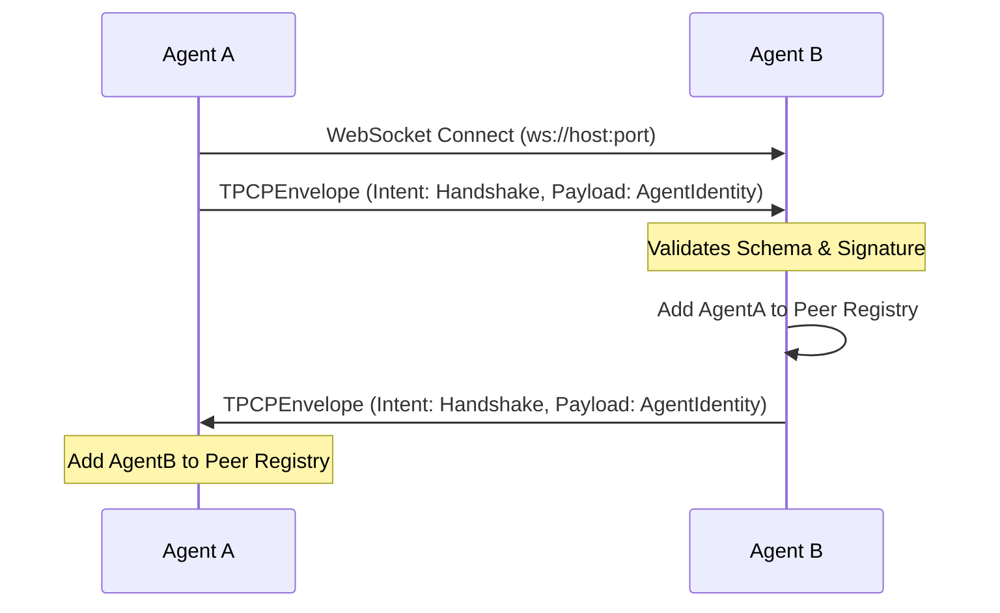

# RFC-001: Telepathy Communication Protocol (TPCP) Core Protocol

**Author:** Principal Systems Architect  
**Status:** Draft  
**Version:** 0.1.0  

## 1. Abstract

The Telepathy Communication Protocol (TPCP) is a framework-agnostic, LLM-agnostic communication standard designed for autonomous agents. It defines a rigorous, type-safe messaging format using JSON envelopes, facilitating intent negotiation, state synchronization, and secure semantic sharing between agents regardless of their internal architecture (e.g., CrewAI, LangGraph, AutoGen).

## 2. Motivation

Current multi-agent systems suffer from framework lock-in and rely on ad-hoc, unstructured text passing for inter-agent communication. There is no unified way to:
- Establish cryptographically verifiable identities.
- Sync complex cognitive state (e.g., Vector Embeddings).
- Handle concurrent distributed memory updates (e.g., using CRDTs).

TPCP introduces a standardized `TPCPEnvelope` to resolve these interoperability hurdles.

## 3. Core Concepts

### 3.1 Agent Identity
Every agent operating on the TPCP network MUST possess a unique `AgentIdentity`. 

- **agent_id**: A unique UUID v4.
- **framework**: A string identifying the agent's framework (e.g., "LangGraph").
- **capabilities**: A list of strings denoting supported skills (e.g., `["web_search", "code_execution"]`).
- **public_key**: A cryptographic public key for signature verification.

### 3.2 Intent Taxonomy
Messages MUST specify an `Intent`. The core intents are:
- `Handshake`: Peer discovery and capability negotiation.
- `Task_Request`: Requesting another agent to perform an action.
- `State_Sync`: Synchronizing distributed memory or context.
- `Critique`: Providing structured feedback on an outcome.
- `Terminate`: Ending a task or connection naturally.

## 4. The Envelope Wire Format

Messages are transmitted as serialized JSON objects defined by the `TPCPEnvelope` schema.

```json
{
  "header": {
    "message_id": "123e4567-e89b-12d3-a456-426614174000",
    "timestamp": "2026-03-11T12:00:00Z",
    "sender_id": "987f6543-e21b-12d3-a456-426614174111",
    "receiver_id": "111a2222-b33c-44d5-e555-666677778888",
    "intent": "Task_Request",
    "ttl": 30
  },
  "payload": {
    "content": "Analyze the attached error logs.",
    "language": "en"
  },
  "signature": "base64_encoded_signature_string"
}
```

## 5. Peer Handshake Protocol

When an agent wants to discover or connect to another agent, it performs a Handshake over WebSockets.



## 6. Future Roadmap

### 6.1 Vector State Synchronization
Future revisions will prioritize `VectorEmbeddingPayload` support. Agents will share dense vector representations of their semantic context instead of raw text, allowing receiving models to inject context directly into their attention mechanisms (where supported) or RAG databases.

### 6.2 Conflict-free Replicated Data Types (CRDTs)
To maintain synchronized whiteboards or shared ledgers between autonomous agents without a central database, TPCP will standardise standard CRDT implementations (`LWW-Element-Set`, `G-Counter`) via the `CRDTSyncPayload`.
